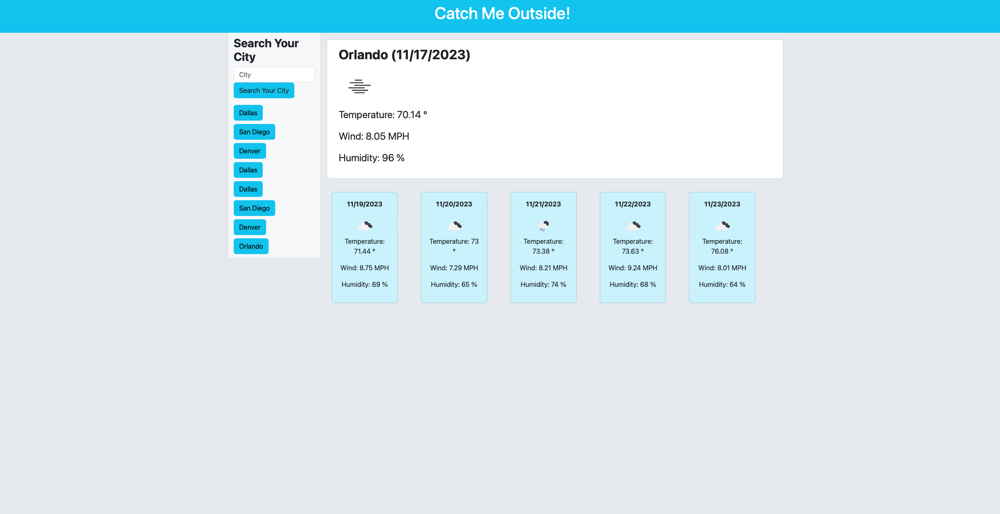

# Catch-Me-Outside-Weather-Dashboard

## Description

This application is a weather dashboard for users to search current and expected weather within the next 5 days. It is a useful tool for people to check the weather for areas they are traveling to, theit local city, and check the weather where loved ones are at. The challemges I faced was getting the weather to dsisplay and for it to not save the 5 day forecast of all prior searched cities. As well as getting the rows right and getting the classing correct in the code. I have a better appreaciation for JQUERY.

## How to Install

Add the url to the browser and it will load the webpage. In the search bar on the page, add the name of the city and hit the 'search' button. The current weahter of the location you chose will be generated along with the 5 day forecast of that area. The cities you have searched before will be saved to local storage.

## User Story

AS A traveler
I WANT to see the weather outlook for multiple cities
SO THAT I can plan a trip accordingly

## Acceptance Criteria

GIVEN a weather dashboard with form inputs
WHEN I search for a city
THEN I am presented with current and future conditions for that city and that city is added to the search history
WHEN I view current weather conditions for that city
THEN I am presented with the city name, the date, an icon representation of weather conditions, the temperature, the humidity, and the wind speed
WHEN I view future weather conditions for that city
THEN I am presented with a 5-day forecast that displays the date, an icon representation of weather conditions, the temperature, the wind speed, and the humidity
WHEN I click on a city in the search history
THEN I am again presented with current and future conditions for that city

## Collaborators

I worked on this on my own using resources such as the instructors, my peers, and class examples and notes.

## Links

Deployed: https://spartanchick619.github.io/Catch-Me-Outside-Weather-Dashboard/

## Screenshot

